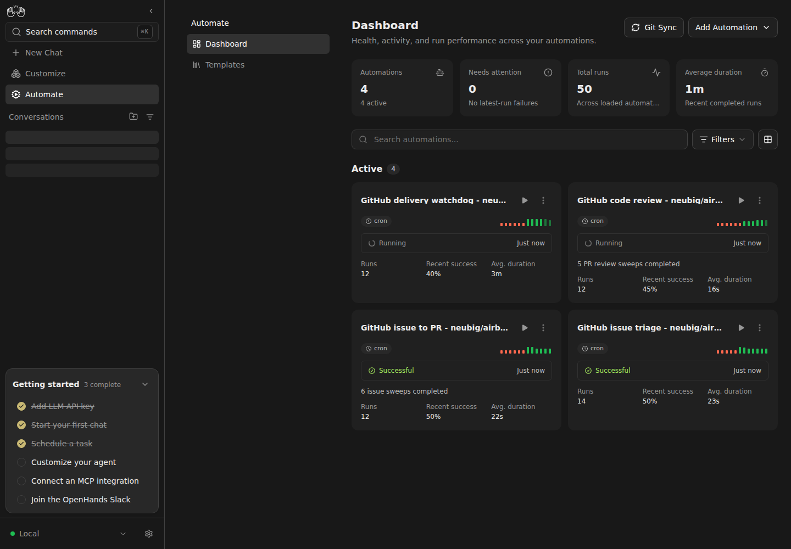

# Live Canvas validation: Docker conversation runtime

Validated on 2026-09-16 in a fresh isolated Canvas state directory.

## Revisions

- Canvas: this PR (`ba7f3d181`) composed with #17237 and #17396.
- Agent Server: software-agent-sdk #3403 at `33c3ef60bbc`, stacked on #5017.
- Automation: #479 plus #481's SDK workspace routing.
- Extensions: #592 with its triage, developer, reviewer, and watchdog children.

## Setup and observation

Canvas launched its local Agent Server with the explicitly configured
`OH_CONVERSATION_*` values, including Docker runtime selection, image, memory,
CPU, persistence, and workspace settings. No Docker interpretation or
provisioning code was added to Canvas.

I configured the LM and added the four extensions through Canvas UI forms. Six
Airbnb issues were triaged and six developer conversations were dispatched.
`docker inspect` showed one runtime container per delegated conversation with an
`ai.openhands.conversation-id` label. Scanner commands continued in the outer
host workspace and created no scanner conversation container.

Environment-name inspection inside active containers showed only
`FACTORY_GITHUB_DEVELOPER_TOKEN` in developer runtimes and only
`FACTORY_GITHUB_REVIEWER_TOKEN` in reviewer runtimes. Values were not read or
recorded. Finished containers were released through the SDK runtime lifecycle
API while their conversation histories remained available.

The exact composed stack completed [neubig/airbnb-clone issue
#83](https://github.com/neubig/airbnb-clone/issues/83): its developer opened [PR
#87](https://github.com/neubig/airbnb-clone/pull/87), the reviewer tested the
exact head and posted a readable native review plus successful test/review
statuses, and the next watchdog cycle merged the unchanged head.

## Focused validation

- `npm test -- --run __tests__/scripts/dev-safe.test.ts`: 60 passed.
- All four automation cards were active in Canvas with no latest-run failures.
- The machine retained more than 6 GiB available after completed runtimes were
  released through the SDK API.
